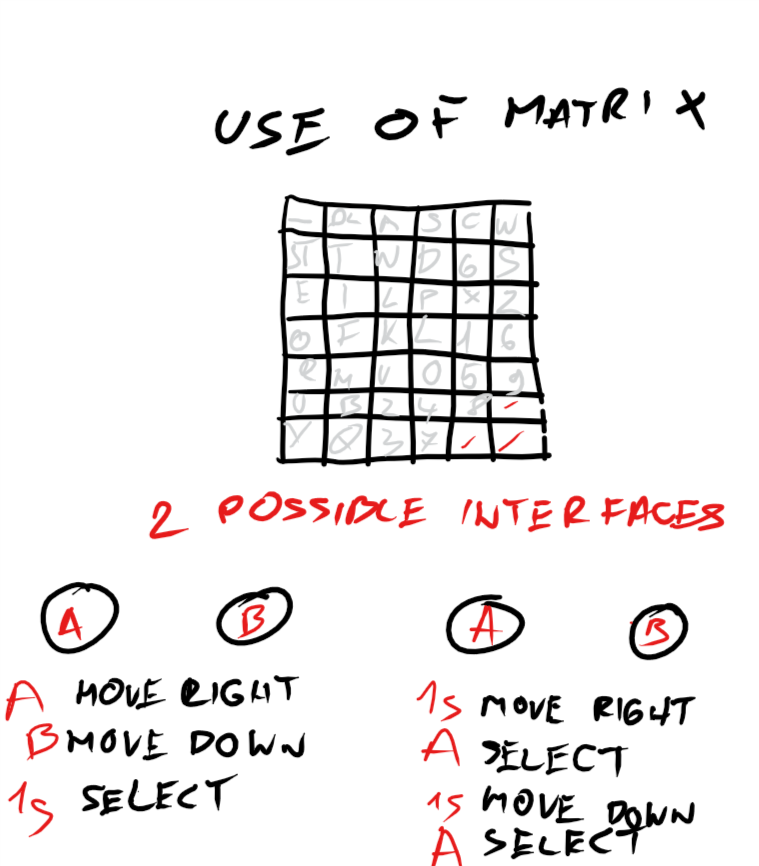

Comunicating app
====================

A morse - binary code comunicating app based on Arduino kits

Contents
---------
  1. [Planning](#planning)
  1. [Design](#design)
  1. [Development](#development)
  1. [Evalution](#evaluation)


Planning
-----------
**Definethe Problem:** NASA is trying to establish comunication between Earth, Moon, and Mars. Fill the requirements for lanugages for each station. I am working on the moon. That means we are dealing with three languages. Because comunication needs to be simple and we need to be able to build the syistem with arduinos, we chose modern C as coding langugage, because we program arduinos in this language by default. We have 2 proposed solutions (expplain that till wednesday). **Ask where goes what for EXAMPLE 2 proposed solutions for keyboard is that plaing desing of development?**

**Succes criteria**

Design
-------
## Two proposed solutions for english input with 2 buttons

**Solution 1** 


**Fig 7.** Fisrt proposed solution with just one line array and 2 buttons - Next and Select
In this solution we use button A to select and button B to move to next letter. This method is easy to code but not so time efficient. This is code I used

**Solution 2**
In this solution I am considering 2 possible verisions of program.


**Fig 8.** This picutre in propsing two differend solutions. 
1. First option is to move right and down with buttons and make selection just with waiting ceratin time period (1sec on the picture). 
1. Second option is slower. Program cycles through colums first and when we press button, colum is selected and rows start cycling. When we press button for the second time letter is chosen.

Development
------------

**Bash and Modern C evaluation**

Modern C

| Proos       | Cons          | 
| :-----------: |:-------------:| 
| Syntax is more forgiving     | Is not pre installed  | 
| More resources online      | By default can't run on every computer withaut any aditional work      |   
|  We can work with decimal numbers | \      |    

Bash

| Proos       | Cons          | 
| :-----------: |:-------------:| 
| Is pre installed   | Syntax is not forgiving  | 
| By default can run on every computer with terminal      | Less resources online  |   
|  \                          | We can't work with decimal numbers      |    

**Types of variables in Modern C**
1. Boolean - can hold only two values, 0 or 1. It uses only 1 byte
1. Float - varaible with decimal point
1. Word - stores an unsigned number from 0 to 65,535
1. Long - extened numberical variable -2,147,483,648 to 2,147,483,647
1. Char - stores a single character as a value
1. unsigned char encodes numbers from 0 to 255
1. int stores an integer from  -32,768 to 32,767
1. usnigned int stores values from 0 to 65,535.


Nov 11
--------
We crated traffic lights from arduino kit. I learned basics of programing arduino in modern C, its not hard to understand and I like functions functionality. Prgoraming in bash I repeated coding process for similar things to many times so fuctions are giving me option to have some basics library to make coding faster. I like this topic a lot because it combines some basic electro enginering with coding and when you code something you actually get phyisical touchable result, not just program running in you computer.


**Fig 1.** First mini arduino project - traffic lights, getting familiar with arduino, getting familiar with concept of ports, learning some bascic coding

Nov 13
-------
How to count from 0 to 15 in binary:

0 0
1. 1
1. 10
1. 11
1. 100
1. 101
1. 110
1. 111
1. 1000
1. 1001
1. 1010
1. 1011
1. 1100
1. 1101
1. 1110
1. 1111

Usign this we created arduino based circut with 4 differend colored LEDs, and programed it to count from 1 to 15 in [binary](#resources)  according to table above. 

This program work, but I would encounter problems if I had more inputs, which would result in very long if sentances.
It also demonstartes how to use button to trigger lights. ```c   if (digitalRead(butA) == LOW && digitalRead(butB) == LOW && digitalRead(butC) == LOW){
 		digitalWrite(out1, HIGH);
  		digitalWrite(out2, HIGH); }
      ```
      

Nov 18
--------


**Fig 4.** Types of binary gates, with tables of inputs and outputs [Source](#Resources)

A logic gates are building blocks of digital circuts or in our case program using binary inputs and outputs. Logic gates have two inputs and one output and are based on Boolean algebra. At any given moment every output is at one of the two binary conditions: true or false - [Source](#Resources). 4 basic gates we explored today are represented in the table above. In terms of matematcial decimal operators, AND is representing + (addition) and OR is representing x (multyplication). 
In modern C OR is represented with ```c | ``` AND is represented with ```c & ``` NOT is represented with ```c ! ``` and XOR is represented with ```c ^ ```

Code below shows how to implement this in program:
```c
  bool eqA = ( (!C) & (!A) ) | B | ( C & A );
 digitalWrite(ledA, eqA);
 ```
Nov 20
-------
We crated seven segment counter using 3 buttons. First step was to create a table of inputs and outputs:

| Button A  | Button B    | Button C     | Decimal Number | A | B | C | D | E | F | G |
| :----: |:----:| :----:|:----:|:----:|:----:|:----:|:----:|:----:|:----:|:----:|
| 0 | 0 | 0 | 0 | 1 | 1 | 1 | 1 | 1 | 1 | 0 |
| 0 | 0 | 1 | 1 | 0 | 0 | 0 | 0 | 1 | 1 | 0 |
| 0 | 1 | 0 | 2 | 1 | 0 | 1 | 1 | 0 | 1 | 1 |
| 0 | 1 | 1 | 3 | 1 | 0 | 0 | 1 | 1 | 1 | 1 |
| 1 | 0 | 0 | 4 | 0 | 1 | 0 | 1 | 1 | 1 | 1 |
| 1 | 0 | 1 | 5 | 1 | 1 | 0 | 1 | 1 | 0 | 1 |
| 1 | 1 | 0 | 6 | 1 | 1 | 1 | 1 | 1 | 0 | 1 |
| 1 | 1 | 1 | 7 | 1 | 0 | 0 | 0 | 0 | 1 | 1 |

Each letter at the top of the colums represents one segment of our counter


**Fig 5.** Seven segment counter

Using logical gates presented earlier, we convertet table (Fig 5.) to set of equations. One equation for each letter. And created a code that will count based on buttons pressed.

```c
int butA = 13;
int butB = 12;
int butC = 11;
int ledA = 7;
int ledB = 6;
int ledC = 5;
int ledD = 4;
int ledE = 3;
int ledF = 2;
int ledG = 1;

void setup()
{
  pinMode(butA, INPUT);
  pinMode(butB, INPUT);
  pinMode(butC, INPUT);
  pinMode(ledA, OUTPUT);
  pinMode(ledB, OUTPUT);
  pinMode(ledC, OUTPUT);
  pinMode(ledD, OUTPUT);
  pinMode(ledE, OUTPUT);
  pinMode(ledF, OUTPUT);
  pinMode(ledG, OUTPUT);
}

void loop()
{
  bool A = digitalRead(butA);
  bool B = digitalRead(butB);
  bool C = digitalRead(butC);

  bool eqA = ( (!C) & (!A) ) | B | ( C & A );
  bool eqB =  ( A & C ) | ( (!B) & (!C) );
  bool eqC = ( (!C) & (!A) ) | ((!C) & B);
  bool eqD = (!C & !A) | (!A & B) | (!C & B) | (A & !B & C);
  bool eqE = C | (!A & !B) | A;
  bool eqF = !B | ( !A & !C ) | ( A & C);
  bool eqG = B | (A & !B);
 
  digitalWrite(ledA, eqA);
  digitalWrite(ledB, eqB);
  digitalWrite(ledC, eqC);
  digitalWrite(ledD, eqD);
  digitalWrite(ledE, eqE);
  digitalWrite(ledF, eqF);
  digitalWrite(ledG, eqG);
}

```
  
  This is circut we used:
  
  
  
  **Fig 6.** Seven segment counter circut

Nov 25
--------
Usability is according to Wikpedia [ [4] ](#Resources) is the ease of use and learnability of a human-made object such as a tool or device.

Human-centered design **HCD** is based on Feedback and Discoverability. Accordning to Joe Posner everything should be intuative and easy to use. [ [5] ](#Resources).
 
Two proposed solutions for english input with 2 buttons
--------------------------------------------------------

**Solution 1** 


**Fig 7.** Fisrt proposed solution with just one line array and 2 buttons - Next and Select
In this solution we use button A to select and button B to move to next letter. This method is easy to code but not so time efficient. This is code I used
```.ino
//This program will allow user ener english

//Then we define array - matrix and buttons
int index = 0;
String text = "";
String keyboard[]={"SEND","DEL","_","a","b","c","d","e","f","g","h","i","j","k","l","m","n","o","p","q","r","s","t","u","v","w","x","y","z"};
int numOptions = 29;

void setup()
{
Serial.begin(9600);
attachInterrupt(0, changeLetter, RISING);
attachInterrupt(1, selected, RISING);
}

void loop()
{
  //This 2 fucntions will repeat infinitly. First one is  prinitng
  //Letter selected to the user and short quick instructions
  //Second prints total message with all selected letters to the user
  Serial.println("Option (Select: butB, Change: butA): " + 
                 keyboard[index]);
  Serial.println("Message: "+ text);
  delay(200);
 
}

//This function changes the letter in the keyboard
void changeLetter(){
  index++;
  //this if condition will reset index count when it reaches end of our alphabet
  if(index>numOptions){
    index=0; //back to begining
  }
}

//this function adds the letter to the text or sends the msg
void selected(){
  String key=keyboard[index];
    if(key=="DEL"){
    	int len= text.length();
      	text.remove(len-1);
  	}
	else if(key=="SEND"){
   		Serial.println("Message sent");
   		text = "";
    }
  	else {
    text+=key;
  }
  index=0;
   
 }
 ```
 This program works, the only problem I am encountering is blinking of serial monitor. I will resolve that when we move to LCD display. 

One of the key parts of this program are **interuptions**. Instead of checking if button is pressed every milisecond, we can leave arduino runing other procces and then interupt this procces with input on pin 2 or 3. After interuption arduino goes back to procces runed before interuption.
1. First step is to set up interuption ports ```c attachInterrupt(0, changeLetter, RISING); ``` , first element in the brackets can only be 0 or 1. 0 is port 2, 1 is port 3 and this are only 2 ports on which interuption can be installed. Second element is function which will interupt main proccess when button on port 2 rises. That is defined in third element.
1. Second step is to write a function we want to interupt current process. Let's take our case as an exaple:
```.ino 
void changeLetter(){
  index++;
  //this if condition will reset index count when it reaches end of our alphabet
  if(index>numOptions){
    index=0; //back to begining
  }
}
```
So when button on port 2 will rise, this function will be performed.

**Solution 2**
In this solution I am considering 2 possible verisions of program.


**Fig 8.** This picutre in propsing two differend solutions. 
1. First option is to move right and down with buttons and make selection just with waiting ceratin time period (1sec on the picture). This was first plan, but I encounter some problmes coding it. Everything is compleatly based on interuptions, so I should figgure out where to add time check, to confirm selection. Also the problem I see with that is that serial monitor is blinking all the time due to looping our main functions.  I will try to solve it but I got another idea which I think its much easier to code. I will work on both and I will se which one works out better. Another imporant thing is to make keyboard vissible all the time. We could just add picture next to the syistem but if we can code it into program that is much better.

1. Second option is slower. Program cycles through colums first and when we press button, colum is selected and rows start cycling. When we press button for the second time letter is chosen. I have idea how to code that, and we also solve blinking problem since we can make cycle interval and delay interval on the loop the same. Problem with showing whole matrix remains the same also in this solution.

This is how far I come with coding matrix before I stuck:
```.ino
//This program will allow user ener english

//First we define pins as variables
int butA = 3;
int butB = 2;

//Then we define array - matrix and buttons
int row = 7;
int col = 6;
int indexRow = 0;
int indexCol = 0;
String text = "";
String keyboard[row][col] = {
  {"_", "DEL", "a", "s", "c", "w"},
  {"SENT", "t", "n", "d", "g", "s"},
  {"e", "i", "l", "p", "x", "z"},
  {"o", "h", "f", "k", "1", "6"},
  {"r", "m", "v", "0", "5", "9"},
  {"u", "b", "z", "4", "8", " "},
  {"y", "q", "3", "7", " "; " "},
}

int butA = 3;
int butB = 2;

void setup()
{
Serial.begin(9600);
attachInterrupt(0, changeRow, RISING);
attachInterrupt(1, changeCol, RISING);
//I need to add select function here, figre out how to do that, conect it to time

void loop()
{
  Serial.println("Option (Move Colum to the right: butA, Move Row down: butB, Select: Wait 1sec): 
	 +keyboard[indexRow][indexCol]);
  Serial.println("Message: " + text);
  delay(100);
}


  
//this function changes the row in the keybord
void changeRow () 
{
  indexRow++;
  //check for the max row numeber
  if(indexRow>row) 
  {
    indexRow=0;//loop back to first row
  }
}
//this function changes colum in the keybord
void changeCol()
{
  indexCol++;
  //check for the max col numeber
  if(indexcol>col)
  {
    indexCol=0; //loop back to first col
  }
}
  


//this funion adds the letter to the text or sends the msg
void selected(){
  string key = keyboard[row][col];
  if(key
  
  
}
```
From here on, I will try to code 2 differend solutions (option1 and option2). I will see which one works out better.

Evaluation
-----------


Resources
----------
1. [1] Stapel, Elizabeth. “Number Bases: Introduction & Binary Numbers.” Purplemath, https://www.purplemath.com/modules/numbbase.htm.
1. [2] **Fig 4.** Account Suspended, https://guidetofortnite.com/2-input-xor-truth-table.html.
1. [3] Account Suspended, https://guidetofortnite.com/2-input-xor-truth-table.html.
1. [4] “Usability.” Wikipedia, Wikimedia Foundation, 13 Nov. 2019, https://en.wikipedia.org/wiki/Usability.
1. [5] Posner J, Mars R. " It's not you, bad doors are everywhere" 2016. Retrived (25 Nov 2019)
