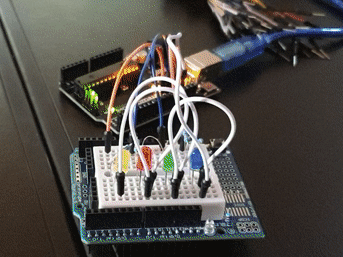
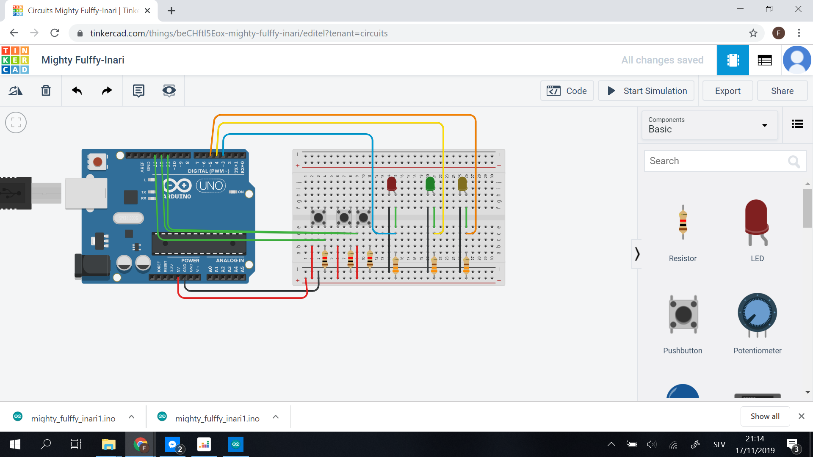

Comunicating app
====================

A morse - binary code comunicating app based on Arduino kits

Contents
---------
  1. [Planning](#planning)
  1. [Design](#design)
  1. [Development](#development)
  1. [Evalution](#evaluation)


Planning
-----------


Design
-------


Development
------------


Nov 11
--------
We crated traffic lights from arduino kit. I learned basics of programing arduino in modern C, its not hard to understand and I like functions functionality. Prgoraming in bash I repeated coding process for similar things to many times so fuctions are giving me option to have some basics library to make coding faster. I like this topic a lot because it combines some basic electro enginering with coding and when you code something you actually get phyisical touchable result, not just program running in you computer.


**Fig 1.** First mini arduino project - traffic lights, getting familiar with arduino, getting familiar with concept of ports, learning some bascic coding

Nov 13
-------
How to count from 0 to 15 in binary:

0 0
1. 1
1. 10
1. 11
1. 100
1. 101
1. 110
1. 111
1. 1000
1. 1001
1. 1010
1. 1011
1. 1100
1. 1101
1. 1110
1. 1111

Usign this we created arduino based circut with 4 differend colored LEDs, and programed it to count from 1 to 15 in [binary](#resources)  according to table above. 
```c
int A = 12;
int B = 9;
int C = 7;
int D = 4;
int i = 0;
//We define our variables 

void setup()
{
  pinMode(A, OUTPUT);
  pinMode(B, OUTPUT);
  pinMode(C, OUTPUT);
  pinMode(D, OUTPUT);
}

void loop()
{
  for (i = 0; i <= 15; i += 1)
  {
    if (i%2 == 1)
    {
      digitalWrite (D, HIGH);
    } 
    if (i%4 > 1)
    {
      digitalWrite (C, HIGH);
    }
    if (i%8 > 3) 
    {
      digitalWrite (B, HIGH);
    }
    if (i%16 > 7)
    {
      digitalWrite (A, HIGH);
    }
    delay (300);
    digitalWrite (D, LOW);
    digitalWrite (C, LOW);
    digitalWrite (B, LOW);
    digitalWrite (A, LOW);
    
  }
}  
```



**Fig 2.** Second mini project - we created Arduino based binary counter that counts from 1 to 15

Nov 17
----------
Homework was to create program that will implement binary table with 3 inputs and 2 outputs. Circut we used for this homework was:



**Fig 3.** Homework binary table

We came up with 2 solutions. One was converting binary numbers to decimal and checking values with if operation. Second was just creating 8 if sentances and defining inputs and outputs to match the table. I did the second one
```c
//This program will implement table given by teacher


// Set variable names to ports on arduino
int butA = 13;
int butB = 12;
int butC = 11;
int out1 = 3;
int out2 = 4;


//define which ports are inputs and which are outputs
void setup ()
{
  pinMode(butA, INPUT);
  pinMode(butB, INPUT);
  pinMode(butC, INPUT);
  pinMode(out1, OUTPUT);
  pinMode(out2, OUTPUT);
}

//turning lights on and off based on pressed buttons
void loop()
{
  if (digitalRead(butA) == LOW && digitalRead(butB) == LOW && digitalRead(butC) == LOW){
 		digitalWrite(out1, HIGH);
  		digitalWrite(out2, HIGH); }
  else if (digitalRead(butA) == LOW && digitalRead(butB) == LOW && digitalRead(butC) == HIGH){
 		digitalWrite(out1, HIGH);
  		digitalWrite(out2, HIGH); }
  else if (digitalRead(butA) == LOW && digitalRead(butB) == HIGH && digitalRead(butC) == LOW){
 		digitalWrite(out1, HIGH);
  		digitalWrite(out2, LOW); }
  else if (digitalRead(butA) == LOW && digitalRead(butB) == HIGH && digitalRead(butC) == HIGH){
 		digitalWrite(out1, HIGH);
  		digitalWrite(out2, LOW); }
  else if (digitalRead(butA) == HIGH && digitalRead(butB) == LOW && digitalRead(butC) == LOW){
 		digitalWrite(out1, LOW);
  		digitalWrite(out2, HIGH); }
  else if (digitalRead(butA) == HIGH && digitalRead(butB) == LOW && digitalRead(butC) == HIGH){
 		digitalWrite(out1, HIGH);
  		digitalWrite(out2, HIGH); }
  else if (digitalRead(butA) == HIGH && digitalRead(butB) == HIGH && digitalRead(butC) == LOW){
 		digitalWrite(out1, HIGH);
  		digitalWrite(out2, HIGH); }
  else {
 		digitalWrite(out1, HIGH);
  		digitalWrite(out2, HIGH); }
}
```
This program work, but I would encounter problems if I had more inputs, which would result in very long if sentances.

Evaluation
-----------


Resources
----------
Stapel, Elizabeth. “Number Bases: Introduction & Binary Numbers.” Purplemath, https://www.purplemath.com/modules/numbbase.htm.

