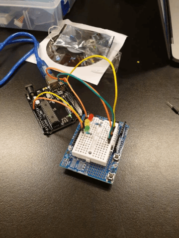

Comunicating app
====================

A morse - binary code comunicating app based on Arduino kits

Contents
---------
  1. [Planning](#planning)
  1. [Design](#design)
  1. [Development](#development)
  1. [Evalution](#evaluation)

Planning
-----------

Design
-------

Development
------------

Evaluation
-----------
Nov 11
--------
We crated traffic lights from arduino kit. I learned basics of programing arduino in modern C, its not hard to understand and I like functions functionality. Prgoraming in bash I repeated coding process for similar things to many times so fuctions are giving me option to have some basics library to make coding faster. I like this topic a lot because it combines some basic electro enginering with coding and when you code something you actually get phyisical touchable result, not just program running in you computer.

**Fig 1.** First mini arduino project - traffic lights, getting familiar with arduino, getting familiar with concept of ports, learning some bascic coding

Nov 13
-------
How to count from 0 to 15 in binary:

0 0
1. 1
1. 10
1. 11
1. 100
1. 101
1. 110
1. 111
1. 1000
1. 1001
1. 1010
1. 1011
1. 1100
1. 1101
1. 1110
1. 1111

## Resources
https://www.purplemath.com/modules/numbbase.htm

