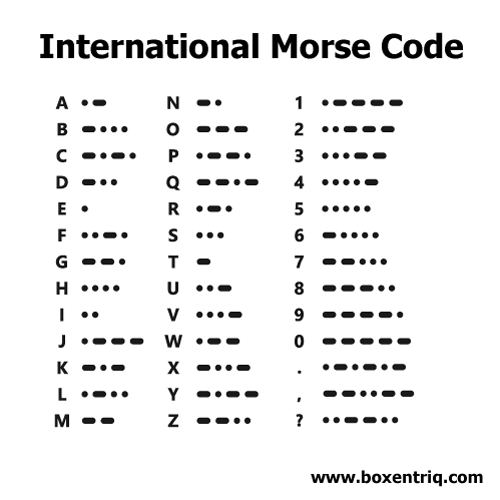
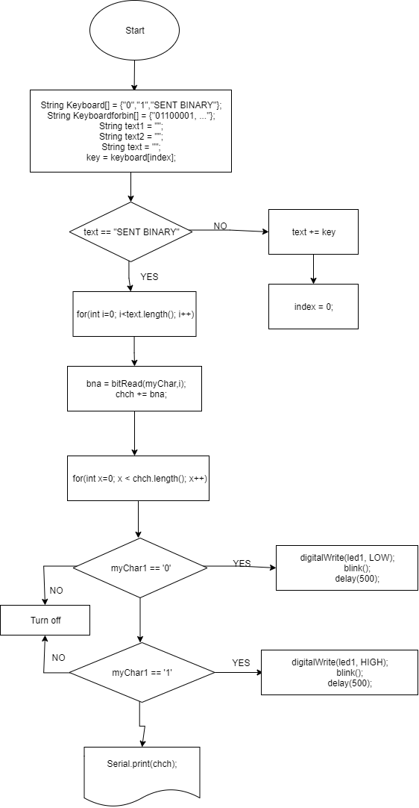

Comunicating app
====================

A morse - binary code comunicating app based on Arduino kits

# Contents

  1. [Planning](#planning)
  1. [Design](#design)
  1. [Development](#development)
  1. [Evalution](#evaluation)


# Planning

**Definethe Problem:** 
It is year 2050, planet exploration is a thing, however comunication is still a problem. NASA is trying to establish comunication between Earth, Moon, and Mars. Earth can send messeges only in morse code and Mars can recive messeges only in binary code. Moon is between Earth and Mars so station on moon can comunicate in both binary and morse code. So we need to come up with the solution that will enable station on earth to enter messege in english and send it in morse code and vice versa. Station on mars need to be able to recive a messege in binary and translate it to english and vice versa. Moon station is most complicated one. Station on moon needs to send and recive in binary and morse and be able to translate everything to englsih. NASA is allowing us to use 100W lights and buzzers. We are limited on using only 2 buttons. My grupe is working on moon station.

**Solution proposed**
We were given Arduino kits to work with. With that we are able to meet all the requirements (2 buttons, lights and buzzers). In clas we are learning modern C and this is default language to program arduinos, that is why we are going to use it for our project. Use of two buttons to meet the reqirements will be explained down bellow.

**Succes criteria for moon station**
1. Messege from Earth can be recived in Morse and translated to english.
1. Messege can be translated from English to morse and be sent back to Earth.
1. Message can be translated from English to binary and be sent do Mars.
1. Messege can be recived in binary from Mars and translated to English.
1. Messege can be recived from earth in Morse and be sent to Mars translated to binary.
1. MEssege can be recived from Mars in binary and be sent to Earth translated to Morse.

# Design

### Design stage 1.0


**Fig. 1** System diagram 1.0

System diagram in Fig.1 is outlining our product, but it is not final since there are still few unclear things in our requirements. 

**Input**
Requirements for input are most clear, but there is still one question? I am considering 2 differend implementations of two buttons (look at "Two proposed solutions for english input with 2 buttons"). We enter messege in english and translate it to binary or Morse. 

But here is a problem we need to solve. If we use both buttons to enter english alphabet, how do we decide if we want to translate to bininary or to morse. To indicate which code is selected I would add more led lights. Depending on code selected according led light would turn on. To switch between Morse and binary I would add one more button but that is not accorind to requirements.

**Output** 
Morse code was created as simplest way to transfer messeges. We need one led ligh (we can also use 2), and we can send messege letter by letter using this table



**Fig 2.** [Morse code table [2] ](#resources)

To change letters into binary code, there is standardized table already in place. It is called ASCII table. (American Standard Code for Information Interchange)


**Fig 3.** [ASCII table [1] ](#resources) 

To output messege according to this table we need 8 LED lights. If Morse needs 1 light and binary needs 8 lights, we will use 8 lights all together. **Everything described above is for sending messeges**. Now first thing I would add here is one more button to switch between sending and reciving mode (not accoring to requirements). *Another problem I need to solve* If we want to have english output of recived messege we need to enter a messege first. We can enter morse code with 2 buttons, to enter binary code we would need 8 buttons. And when we recive code and enter it we still to show english messege to the user. For that we would need a display.

There are a lot of unclear things about this project and its requirements, so I will contact NASA as soon as possible to sort these things out :)

### Two proposed solutions for english input with 2 buttons

**Solution 1** 


**Fig 4.** Fisrt proposed solution with just one line array and 2 buttons - Next and Select
In this solution we use button A to select and button B to move to next letter. This method is easy to code but not so time efficient. This is code I used

**Solution 2**
In this solution I am considering 2 possible verisions of program.


**Fig 5.** This picutre in propsing two differend solutions. 
1. First option is to move right and down with buttons and make selection just with waiting ceratin time period (1sec on the picture). 
1. Second option is slower. Program cycles through colums first and when we press button, colum is selected and rows start cycling. When we press button for the second time letter is chosen.

### Design stage 2.0
After talking to NASA, all the questions from **Design stage 1.0** were resolved. Here is **System diagram 2.0**


**Fig 6.** System diagram 2.0

As shown in fig 6, input method for our sytem will be simple. Just 2 buttons. One to move on next argument in the menu, and one to confirm our choice. Menu will be organized in 4 (or 6 if we have time) main functions. Eng - Bin, Eng - Morse, Bin - Eng, Morse - Eng. 
If one of the first two options are selected, array of letters and numbers will shop up on LCD display. For now, we will use simple 1d array not matrix as metioned in design stage 1.0. User will enter the messege, program will convert it to chosen code and 100w light will transmit it. Because we don't need all the characters from ASCII table metntioned in Design stage 1.0, we will crate custm char to binary coverstaion table and implement it. By doing this we will reduce number of bits required to send one character.

If thrid or forth option is selected, arduino will enter recive mode.  User will be be able to enter coded messege in chosen code. Messege will be converted to english and shown on LCD display.

LED indicators are added to the system, to show user in which mode is now. Depending on function user will chose, one of four LEDs will turn on. 1 for Eng - Bin, 2 for Eng - Morse, 3 for Bin - Eng, 4 for Morse - Eng.


# Development


**Bash and Modern C evaluation**

Modern C

| Proos       | Cons          | 
| :-----------: |:-------------:| 
| Syntax is more forgiving     | Is not pre installed  | 
| More resources online      | By default can't run on every computer withaut any aditional work      |   
|  We can work with decimal numbers | \      |    

Bash

| Proos       | Cons          | 
| :-----------: |:-------------:| 
| Is pre installed   | Syntax is not forgiving  | 
| By default can run on every computer with terminal      | Less resources online  |   
|  \                          | We can't work with decimal numbers      |    

**Types of variables in Modern C**
1. Boolean - can hold only two values, 0 or 1. It uses only 1 byte
1. Float - varaible with decimal point
1. Word - stores an unsigned number from 0 to 65,535
1. Long - extened numberical variable -2,147,483,648 to 2,147,483,647
1. Char - stores a single character as a value
1. unsigned char encodes numbers from 0 to 255
1. int stores an integer from  -32,768 to 32,767
1. usnigned int stores values from 0 to 65,535.


Traffic lights
--------
We crated traffic lights from arduino kit. I learned basics of programing arduino in modern C, its not hard to understand and I like functions functionality. Prgoraming in bash I repeated coding process for similar things to many times so fuctions are giving me option to have some basics library to make coding faster. I like this topic a lot because it combines some basic electro enginering with coding and when you code something you actually get phyisical touchable result, not just program running in you computer.


**Fig 7.** First mini arduino project - traffic lights, getting familiar with arduino, getting familiar with concept of ports, learning some bascic coding

Counting in binary
-------
How to count from 0 to 15 in binary:

0 0
1. 1
1. 10
1. 11
1. 100
1. 101
1. 110
1. 111
1. 1000
1. 1001
1. 1010
1. 1011
1. 1100
1. 1101
1. 1110
1. 1111

Usign this we created arduino based circut with 4 differend colored LEDs, and programed it to count from 1 to 15 in [binary [3] ](#resources)  according to table above. 

This program work, but I would encounter problems if I had more inputs, which would result in very long if sentances.
It also demonstartes how to use button to trigger lights. ```c   if (digitalRead(butA) == LOW && digitalRead(butB) == LOW && digitalRead(butC) == LOW){
 		digitalWrite(out1, HIGH);
  		digitalWrite(out2, HIGH); }
      ```
      

Logic binary gates
--------


**Fig 8.** Types of binary gates, with tables of inputs and outputs [Source [4] ](#Resources)

A logic gates are building blocks of digital circuts or in our case program using binary inputs and outputs. Logic gates have two inputs and one output and are based on Boolean algebra. At any given moment every output is at one of the two binary conditions: true or false - [Source [5] ](#Resources). 4 basic gates we explored today are represented in the table above. In terms of matematcial decimal operators, AND is representing + (addition) and OR is representing x (multyplication). 
In modern C OR is represented with ```c | ``` AND is represented with ```c & ``` NOT is represented with ```c ! ``` and XOR is represented with ```c ^ ```

Code below shows how to implement this in program:
```c
  bool eqA = ( (!C) & (!A) ) | B | ( C & A );
 digitalWrite(ledA, eqA);
 ```
Segment counter
-------
We crated seven segment counter using 3 buttons. First step was to create a table of inputs and outputs:

| Button A  | Button B    | Button C     | Decimal Number | A | B | C | D | E | F | G |
| :----: |:----:| :----:|:----:|:----:|:----:|:----:|:----:|:----:|:----:|:----:|
| 0 | 0 | 0 | 0 | 1 | 1 | 1 | 1 | 1 | 1 | 0 |
| 0 | 0 | 1 | 1 | 0 | 0 | 0 | 0 | 1 | 1 | 0 |
| 0 | 1 | 0 | 2 | 1 | 0 | 1 | 1 | 0 | 1 | 1 |
| 0 | 1 | 1 | 3 | 1 | 0 | 0 | 1 | 1 | 1 | 1 |
| 1 | 0 | 0 | 4 | 0 | 1 | 0 | 1 | 1 | 1 | 1 |
| 1 | 0 | 1 | 5 | 1 | 1 | 0 | 1 | 1 | 0 | 1 |
| 1 | 1 | 0 | 6 | 1 | 1 | 1 | 1 | 1 | 0 | 1 |
| 1 | 1 | 1 | 7 | 1 | 0 | 0 | 0 | 0 | 1 | 1 |

Each letter at the top of the colums represents one segment of our counter


**Fig 9.** Seven segment counter

Using logical gates presented earlier, we convertet table (Fig 8.) to set of equations. One equation for each letter. And created a code that will count based on buttons pressed.

```c
// Defining variables as pins
int butA = 13;
int butB = 12;
int butC = 11;
int ledA = 7;
int ledB = 6;
int ledC = 5;
int ledD = 4;
int ledE = 3;
int ledF = 2;
int ledG = 1;

// Defining pins as inputs ans outputs
void setup()
{
  pinMode(butA, INPUT);
  pinMode(butB, INPUT);
  pinMode(butC, INPUT);
  pinMode(ledA, OUTPUT);
  pinMode(ledB, OUTPUT);
  pinMode(ledC, OUTPUT);
  pinMode(ledD, OUTPUT);
  pinMode(ledE, OUTPUT);
  pinMode(ledF, OUTPUT);
  pinMode(ledG, OUTPUT);
}

void loop()
//Defining buttons as variables I will use in equations
{
  bool A = digitalRead(butA);
  bool B = digitalRead(butB);
  bool C = digitalRead(butC);

  bool eqA = ( (!C) & (!A) ) | B | ( C & A );
  bool eqB =  ( A & C ) | ( (!B) & (!C) );
  bool eqC = ( (!C) & (!A) ) | ((!C) & B);
  bool eqD = (!C & !A) | (!A & B) | (!C & B) | (A & !B & C);
  bool eqE = C | (!A & !B) | A;
  bool eqF = !B | ( !A & !C ) | ( A & C);
  bool eqG = B | (A & !B);
 
  digitalWrite(ledA, eqA);
  digitalWrite(ledB, eqB);
  digitalWrite(ledC, eqC);
  digitalWrite(ledD, eqD);
  digitalWrite(ledE, eqE);
  digitalWrite(ledF, eqF);
  digitalWrite(ledG, eqG);
}

```
  
  This is circut we used:
  
  
  
  **Fig 10.** Seven segment counter circut

Usability
--------
Usability is according to Wikpedia [ [6] ](#Resources) is the ease of use and learnability of a human-made object such as a tool or device.

Human-centered design **HCD** is based on Feedback and Discoverability. Accordning to Joe Posner everything should be intuative and easy to use. [ [7] ](#Resources).
 
Two proposed solutions for english input with 2 buttons
--------------------------------------------------------

**Solution 1** 


**Fig 11.** Fisrt proposed solution with just one line array and 2 buttons - Next and Select
In this solution we use button A to select and button B to move to next letter. This method is easy to code but not so time efficient. This is code I used
```.ino
//This program will allow user ener english

//Then we define array - matrix and buttons
int index = 0;
String text = "";
String keyboard[]={"SEND","DEL","_","a","b","c","d","e","f","g","h","i","j","k","l","m","n","o","p","q","r","s","t","u","v","w","x","y","z"};
int numOptions = 29;

void setup()
{
Serial.begin(9600);
attachInterrupt(0, changeLetter, RISING);
attachInterrupt(1, selected, RISING);
}

void loop()
{
  //This 2 fucntions will repeat infinitly. First one is  prinitng
  //Letter selected to the user and short quick instructions
  //Second prints total message with all selected letters to the user
  Serial.println("Option (Select: butB, Change: butA): " + 
                 keyboard[index]);
  Serial.println("Message: "+ text);
  delay(200);
 
}

//This function changes the letter in the keyboard
void changeLetter(){
  index++;
  //this if condition will reset index count when it reaches end of our alphabet
  if(index>numOptions){
    index=0; //back to begining
  }
}

//this function adds the letter to the text or sends the msg
void selected(){
  String key=keyboard[index];
    if(key=="DEL"){
    	int len= text.length();
      	text.remove(len-1);
  	}
	else if(key=="SEND"){
   		Serial.println("Message sent");
   		text = "";
    }
  	else {
    text+=key;
  }
  index=0;
   
 }
 ```
 This program works, the only problem I am encountering is blinking of serial monitor. I will resolve that when we move to LCD display. 

First key part used in this program is **array**. We use it to define arguments we will be using in the program. Type of variable we define if we are putting letters in the array is ``` String ```. After name we define for array we add ``` [n]``` . In bracets we specifiy number of arguments in array. If we don't specifiy it, program coutns arguments instead of us. We separate arguments with coma, each argument needs to be market with ``` ' ' ``` if specified type of variable is ```c int ``` and we are using numbers. If specified type of variable is ``` String ``` and we are using letters and other signs, each argument needs to be marked with ``` " " ```. So syntax all together looks like this ``` String arrayexample [5] = {"a", "b", "c", "d", "e"}

Second of the key parts of this program are **interuptions**. Instead of checking if button is pressed every milisecond, we can leave arduino runing other procces and then interupt this procces with input on pin 2 or 3. After interuption arduino goes back to procces runed before interuption.
1. First step is to set up interuption ports ``` attachInterrupt(0, changeLetter, RISING); ``` , first element in the brackets can only be 0 or 1. 0 is port 2, 1 is port 3 and this are only 2 ports on which interuption can be installed. Second element is function which will interupt main proccess when button on port 2 rises. That is defined in third element.
1. Second step is to write a function we want to interupt current process. Let's take our case as an exaple:
```.ino 
void changeLetter(){
  index++;
  //this if condition will reset index count when it reaches end of our alphabet
  if(index>numOptions){
    index=0; //back to begining
  }
}
```
So when button on port 2 will rise, this function will be performed.

**Solution 2**
In this solution I am considering 2 possible verisions of program.


**Fig 12.** This picutre in propsing two differend solutions. 
1. First option is to move right and down with buttons and make selection just with waiting ceratin time period (1sec on the picture). This was first plan, but I encounter some problmes coding it. Everything is compleatly based on interuptions, so I should figgure out where to add time check, to confirm selection. Also the problem I see with that is that serial monitor is blinking all the time due to looping our main functions.  I will try to solve it but I got another idea which I think its much easier to code. I will work on both and I will se which one works out better. Another imporant thing is to make keyboard vissible all the time. We could just add picture next to the syistem but if we can code it into program that is much better.

1. Second option is slower. Program cycles through colums first and when we press button, colum is selected and rows start cycling. When we press button for the second time letter is chosen. I have idea how to code that, and we also solve blinking problem since we can make cycle interval and delay interval on the loop the same. Problem with showing whole matrix remains the same also in this solution.

This is how far I come with coding matrix before I stuck:
```.ino
//This program will allow user ener english

//First we define pins as variables
int butA = 3;
int butB = 2;

//Then we define array - matrix and buttons
int row = 7;
int col = 6;
int indexRow = 0;
int indexCol = 0;
String text = "";
String keyboard[row][col] = {
  {"_", "DEL", "a", "s", "c", "w"},
  {"SENT", "t", "n", "d", "g", "s"},
  {"e", "i", "l", "p", "x", "z"},
  {"o", "h", "f", "k", "1", "6"},
  {"r", "m", "v", "0", "5", "9"},
  {"u", "b", "z", "4", "8", " "},
  {"y", "q", "3", "7", " "; " "},
}

int butA = 3;
int butB = 2;

void setup()
{
Serial.begin(9600);
attachInterrupt(0, changeRow, RISING);
attachInterrupt(1, changeCol, RISING);
//I need to add select function here, figre out how to do that, conect it to time

void loop()
{
  Serial.println("Option (Move Colum to the right: butA, Move Row down: butB, Select: Wait 1sec): 
	 +keyboard[indexRow][indexCol]);
  Serial.println("Message: " + text);
  delay(100);
}


  
//this function changes the row in the keybord
void changeRow () 
{
  indexRow++;
  //check for the max row numeber
  if(indexRow>row) 
  {
    indexRow=0;//loop back to first row
  }
}
//this function changes colum in the keybord
void changeCol()
{
  indexCol++;
  //check for the max col numeber
  if(indexcol>col)
  {
    indexCol=0; //loop back to first col
  }
}
  


//this funion adds the letter to the text or sends the msg
void selected(){
  string key = keyboard[row][col];
  if(key
  
  
}
```
From here on, I will try to code 2 differend solutions (option1 and option2). I will see which one works out better.

To crate 2D array or matrix we use same syntax as for array, only difference is that we use ```c [row][col] ``` at instead of ```c [] ```. First bracket defines rows and second colums. Type of variable we are using is string. So put this all together and we get ```c String matrixexample[][] = {   } ```. Example how we can create 2D array of symbols used for our purposes below:
```c
String keyboard[row][col] = {
  {"_", "DEL", "a", "s", "c", "w"},
  {"SENT", "t", "n", "d", "g", "s"},
  {"e", "i", "l", "p", "x", "z"},
  {"o", "h", "f", "k", "1", "6"},
  {"r", "m", "v", "0", "5", "9"},
  {"u", "b", "z", "4", "8", " "},
  {"y", "q", "3", "7", " "; " "},
  ```
  
English keyboad on LCD
-----------------------
We builded arduino LCD circut. Sketch from Thinkercad and actual build shown bellow:


**Fig 13.** Arduino LCD Circuit sketch from Thinkercad


**Fig 14.** Arduino LCD circuit

Code below is working. It eneable user to enter englsih alphabet.

```.ino
// include the library code:
#include <LiquidCrystal.h>
int index = 0; 
// add all the letters and digits to the keyboard
String keyboard[]={" ", "A", "B", "C", "D", "E", "F", "G", "H", "I", "J", "K", "L", "M", "N", "O", "P", "Q", "R", "S", "T", "U", "V", "W", "X", "Y", "Z", "1", "2", "3", "4", "5", "6", "7", "8", "9", "0", "SENT", "DEL"};
String text = "";
int numOptions = 29;

// initialize the library with the numbers of the interface pins
LiquidCrystal lcd(12, 11, 7, 6, 5, 4);

void setup() {
  // set up the LCD's number of columns and rows:
  lcd.begin(16, 2);
  // Print a message to the LCD.
  attachInterrupt(0, changeLetter, RISING);//button A in port 2
  attachInterrupt(1, selected, RISING);//button B in port 3
}

void loop() {
  // set the cursor to column 0, line 1
  // (note: line 1 is the second row, since counting begins with 0):
  lcd.clear();
  lcd.setCursor(0, 0);
  lcd.print(keyboard[index]);
  lcd.setCursor(0, 1);
  lcd.print(text);
  delay(100);
}

//This function changes the letter in the keyboard
void changeLetter(){
  static unsigned long last_interrupt_time = 0;
  unsigned long interrupt_time = millis();
  if (interrupt_time - last_interrupt_time > 200)
  {
  
    last_interrupt_time = interrupt_time;// If interrupts come faster than 200ms, assum
    index++;
      //check for the max row number
    if(index==numOptions){
      index=0; //loop back to first row
    } 
 }
}

//this function adds the letter to the text or send the msg
void selected(){
  static unsigned long last_interrupt_time = 0;
  unsigned long interrupt_time = millis();
  if (interrupt_time - last_interrupt_time > 200)
  {
  
    last_interrupt_time = interrupt_time;// If interrupts come faster than 200ms, assum
    
    String key = keyboard[index];
    if (key == "DEL")
    {
      int len = text.length();
      text.remove(len-1);
    }
    else if(key == "SENT")
    {
      text="";
    }else{
      text += key;
    }
    index = 0; //restart the index
  }
  
  
  //
}

```


**Fig 15.** This is flow diagram for English keyboard (Source: Dr. Ruben)
**Keyboard program:**
Code presented above is first code for english input. Code presented in flow diagram is showing how final version will look with added functions that our Arduino system will be able to perform. This is core of our program. It is not just input method for text, but it's our main interface. Plan is to enable user to select one out of of 4 options: Send entered text in morse, send entered text in binary, translate from binary to morse and translate from morse to binary.

1. First part of the program is just instalizing LCD display. Dr. Ruben gave us the code. Fully explaind instalization can be found on this [ website [8] ](#Resources).
1. If button A is pressed we increase index number by 1. That makes char in keyboard shift to the next one. If button is pressed 42 times index is reset to 0 to make to strat keyboard from the begining.
1. If button B is pressed selection on the keyboard is confirmed. If char is selected, program adds it to a text string, if one of the functions is selected programs initiates the function.


**Protocol:**

We began by learning about protocols used in technology today, furthering our background information so we can create our own protocol to communicate effectively.

**Table 5:**  Most used [ protocols [9] ](#Resources) today, their creators and their functions 

| Name  | Creator | Summary |
| :----: |:----:| :----:|
| IP | Vint Cerf & Bob Kahn | Interface identification address in the network | 
| FTP | Abhay Bhusan | Transfer files between client and server | 
| SSH | Tatu Ylonen | Log into a remote machine and execute commands | 
| SMTP | RFC821 | Send/recieve emails | 
| Telnet | UCLA | Used on the internet or local area network |
| POP3 | Mark Crispin | Used to send/receive emails and download emails | 
| HTTP | Tim Berners-Lee | Used on worldwide web for anything clickable (hyperlinks, etc) | 
| VPN | Gurdeep Singh-Pall  | Provides encrypted internet connections | 

English text to morse code
----------------------------
After this stage our group of 4 members devided into 4 and each of us got one task work on. Here will be development process of my part explaind in detail. Other 3 parts will be just added here and briefly/quickly explained.

**Thinking process**
Problem I needed to solve was how to change enetered text to morse code and show it with lights. I was presented with neww very usefull function in C for solving that kind of a problem. **Switch case**. [ Syntax [10] ](#Resources) for it is
``c
switch (var) {
  case label1:
    // statements
    break;
  case label2:
    // statements
    break;
  default:
    // statements
    break;
}
``
It allowes us to compare label in every case with variable. This is especially usefull in array case where a big number of characters falls under same variable.

So idea was to create case for every character in keyboard and then depending on character add specific set of numbers to a new string. I decided to use 1 as dot, 2 as dash, and 0 as space between words. I connect all that with a loop that goes through every agument in text array and add set of numbers to new array. When I have new array I loop thorugh it again and use same process with swithc case to define what lights should do for dot (1), dash (2) and for space. (3)

Second part of the problem was how to send morse code with lights. Original protocl was made for use with simple printer so it's to fasr for our light system. We had 2 possible solutions.

**Solution 1** One light time based solution. The protocol other groupe, that was working on morse, come up with was
```
A dot means you light the light for one second (light on)
A dash is three seconds (light on) 
Between parts of letter is one second (light off)
Between letters is two second (light off)
Between words is 4 seconds (light off)

Indicate the beginning and end of a message it’ll flash five times (for half a second per flash) (light on)

```
Advantages un disadvantages are presented bellow:

| Pros  | Cons    |
| :----: |:----:| 
| Appears to be easier to code | May be difficult to differentiate flashes of light | 
| Only uses one light | Slow to send messages | 
| More energy efficient | Need to wait to understand what's being sent |

**Solution 2** Two lights based solution. This system would use to lights. One light is blinking and this is control light. When control light is on this means ``read``. So when this light is on you check second one. If it is on that is dash, if its off that is dot. If both are of nothing is send. 

Advantages and disadvantages of this system:

| Pros  | Cons  |
| :----: |:----:|
| Easier to read than time-based | May be more complicated | 
| Need to watch instead of wait | Hard to differentiate between spaces | 
| Immediately know what's happening | Hard to differentiate between messages |

Considering both tables, the other group decided to do time based solution, so if we wanted to comunicate with them we needed to use same protocol (On the last day of class time to work on project, other group told me that they changed protocol on 2 lights but they didn't comunicated that to us). (in detail instrucitons above under **solution 1**) 

Now we have string of ones, twos and zeroes. Implementing protocol in previsouly presented soltions would look like that:
0. If zero comes up in string, we turn off light for 4 sec. That means space
1. If 1 comes up in string, we turn on light for 1 sec and turn it off for 1 sec - dot
2. If 2 comes up in string, we turn on light for 3 sec and turi it off for 1 sec - dash
3. This is number added to decoding sytem later. It is added after every completed letter so we know when last leter stops transmiting and next letter starts. So to normal 1 sec pause is added 1 more sec for 2 seconds pause between letters

Everything descirbet above is summarised in this flow diagram:


**Fig 16.** Flow diagram of eng to morse function

As a result of flow diagram and planing presented above here is final working code:

```c

// include the library code:
#include <LiquidCrystal.h>
int index = 0; 
// add all the letters and digits to the keyboard
String keyboard[]={ "SENT"," ", "A", "B", "C", "D", "E", "F", "G", "H", "I", "J", "K", "L", "M", "N", "O", "P", "Q", "R", "S", "T", "U", "V", "W", "X", "Y", "Z", "1", "2", "3", "4", "5", "6", "7", "8", "9", "0", "DEL"};
String text = "";
String mess = "";
int numOptions = 39;
int i;
int led=8;

// initialize the library with the numbers of the interface pins
LiquidCrystal lcd(12, 11, 7, 6, 5, 4);

void setup() {
  Serial.begin(9600);
  pinMode(led, OUTPUT);
  // set up the LCD's number of columns and rows:
  lcd.begin(16, 2);
  // Print a message to the LCD.
  attachInterrupt(0, changeLetter, RISING);//button A in port 2
  attachInterrupt(1, selected, RISING);//button B in port 3
}

void loop() {
  // set the cursor to column 0, line 1
  // (note: line 1 is the second row, since counting begins with 0):
  lcd.clear();
  lcd.setCursor(0, 0);
  lcd.print(keyboard[index]);
  lcd.setCursor(0, 1);
  lcd.print(text);
  delay(100);
}

//This function changes the letter in the keyboard
void changeLetter(){
  static unsigned long last_interrupt_time = 0;
  unsigned long interrupt_time = millis();
  if (interrupt_time - last_interrupt_time > 200)
  {
  
    last_interrupt_time = interrupt_time;// If interrupts come faster than 200ms, assum
    index++;
      //check for the max row number
    if(index==numOptions){
      index=0; //loop back to first row
    } 
 }
}

//this function adds the letter to the text or send the msg
void selected(){
  static unsigned long last_interrupt_time = 0;
  unsigned long interrupt_time = millis();
  if (interrupt_time - last_interrupt_time > 200)
  {
  
    last_interrupt_time = interrupt_time;// If interrupts come faster than 200ms, assum
    
    String key = keyboard[index];
    if (key == "DEL")
    {
      int len = text.length();
      text.remove(len-1);
    }
    else if(key == "SENT")
    {
      for(i=0; i<text.length(); i++) {
        switch(text[i]) {
          case ' ':
          mess+="0";
          break;
          case 'A': 
           mess=mess+"12";
          break;
          case 'B':
            mess=mess+"2111";
          break;
          case 'C':
            mess=mess+"2121";
          break;
          case 'D':
          mess+="211";
          break;
          case 'E':
          mess+="1";
          break;
          case 'F':
          mess+="1121";
          break;
          case 'G':
          mess+="221";
          break;
          case 'H':
          mess+="1111";
          break;
          case 'I':
          mess+="11";
          break;
          case 'J':
          mess+="1222";
          break;
          case 'K':
          mess+="212";
          break;
          case 'L':
          mess+="1211";
          break;
          
          case 'M':
          mess+="22";
          break;
          
          case 'N':
          mess+="21";
          break;
          
          case 'O':
          mess+="222";
          break;
          
          case 'P':
          mess+="1221";
          break;
          
          case 'Q':
          mess+="2212";
          break;

          case 'R':
          mess+="121";
          break;

          case 'S':
          mess+="111";
          break;

          case 'T':
          mess+="2";
          break;

          case 'U':
          mess+="112";
          break;

          case 'V':
          mess+="1112";
          break;

          case 'W':
          mess+="122";
          break;

          case 'X':
          mess+="2112";
          break;

          case 'Y':
          mess+="2122";
          break;

          case 'Z':
          mess+="2211";
          break;

          case '1':
          mess+="12222";
          break;

          case '2':
          mess+="11222";
          break;

          case '3':
          mess+="11122";
          break;

          case '4':
          mess+="11112";
          break;

          case '5':
          mess+="11111";
          break;

          case '6':
          mess+="21111";
          break;

          case '7':
          mess+="22111";
          break;

          case '8':
          mess+="22211";
          break;

          case '9':
          mess+="22221";
          break;

          case '0':
          mess+="22222";
          break;
        }
        mess+="3";
      }
      Serial.print(mess);
       for(i=0; i<7; i++) {
        blinkLight(300, 300);
      }
      for(i=0; i<mess.length(); i++) {
        switch (mess[i]) {
          case '0':
          delay(3000);
          break;
          
          case '1':
          blinkLight(1000, 1000);
          break;
          
          case '2':
          blinkLight(3000, 1000);
          break;
          
          case '3':
          delay(1000);
          break;
        }
      }
      
      for(i=0; i<7; i++) {
        blinkLight(300, 300);
      }
      		
          
      text="";
    }else{
      text += key;
    }
    index = 0; //restart the index
  }

  
  //
}
    
    void blinkLight(int on, int off) {
      digitalWrite(led, HIGH);
      delay(on);
      digitalWrite(led, LOW);
      delay(off);
      
    }
    
  ```
  
English text to binary code
-----------------------------
  


**Fig 17.** Flow diagram of eng to morse function (Source: Lingye)

I was not working in this part of the program. Program is using function to translate english to binary. For output, we are using 2 lights. One is just control light. If control light is turned on you read from second light. If it's on you read 1 if it's off you read 0. If control light is off you don't read. Working parts of code that are resposible for that translation shown bellow (Source: Lingye and Tuan):
```c
//If sent binary function is chosen do following:
    }
    else if(key == "SENT BINARY")
    {
      EtoB();
      turnOnOff();
      sentbin();
      turnOnOff();
      text="";
}
    
    else{
      text += key;
    }
    index = 0; //restart the index
  }
}

void EtoB(){

for(int i=0; i<text.length(); i++){

   char myChar = text.charAt(i);
 //Function to translate english to binary
    for(int i=7; i>=0; i--){
      bna = bitRead(myChar,i);
      chch += bna; 
    }
}
}

  
void sentbin(){
    for(int x=0; x < chch.length(); x++){
      char myChar1 = chch.charAt(x);
      if(myChar1 == '0'){
        digitalWrite(led1, LOW);
        blink();
        delay(500);
      } else if(myChar1 == '1'){
        digitalWrite(led1, HIGH);
        blink();
        delay(500);
      } else {
        turnOff();
      }
    }
  }
//Function resposible for blinking
void blink(){
  digitalWrite(led2, HIGH);
  delay(500);
  digitalWrite(led2, LOW);
  delay(500);
}

//function resposible for turning lights on and off
void turnOnOff(){
 digitalWrite(led1, HIGH);
 digitalWrite(led2, HIGH);
 delay(500);
 digitalWrite(led1, LOW);
 digitalWrite(led2, LOW);
 delay(500);
}

void turnOff(){
 digitalWrite(led1, LOW);
 digitalWrite(led2, LOW);
 delay(500);
}
```

Morse to binary (Morse to english)
-----------------


Evaluation
-----------
**Evaluation succes crieria**


**Fig 18.** Evaluation table

1. [Video 1](https://drive.google.com/open?id=1t6drf_LhwDHJ_7kWhGcIYvnmlZlNniQw)
1. [Video 2](https://drive.google.com/open?id=1N0ppAdLT-Msuy6DMo38uvPxOd7if45Nq)
1. [Video 3](https://drive.google.com/open?id=1foNOE6SuTGCrhmjI1fMeeStQO6ZQm0_F)
1. [Video 4](https://drive.google.com/open?id=1ENVzTCtF7SSiuMqnQ1Ur1VM5aNTFTugc)

### Improvements
1. First of all, add all the functions in one program and make it work as a whole. 
1. Time based protocol for transmiting morse code with one light is hard to read. Two lights system is much easier to read so I would go for that one next time.
1. Trasnfering programs from TinkerCad to actual arudino meesed up our timings, thus timing of blinks is not as planed. If we had more time we would play around with delays a bit more to make it working perfect.
1. Keyboard is slow to use. For example if you miss key you wanted to press... you need to press next button 42 times to get back to it again. We could improve it by making 2D array. Idea was brought up in planing process, but then slower alternative stayed in use because it was perfectly functional and much easier to code... just SLOW.
1. Evaluation and testing should be done practicaly. We should try to transmit messege and anther group should try reciving it and vice versa
1. 


Resources
----------
1. [1] **Fig 3.** Vivah, Linda. “Learn How to Read Binary in 5 Minutes.” Medium, Medium, 22 June 2018, https://medium.com/@LindaVivah/learn-how-to-read-binary-in-5-minutes-dac1feb991e.
1. [2] **Fig 2.** Åhlén, Johan. “Morse Code Translator, Decoder, Alphabet.” Boxentriq, https://www.boxentriq.com/code-breaking/morse-code.
1. [3] Stapel, Elizabeth. “Number Bases: Introduction & Binary Numbers.” Purplemath, https://www.purplemath.com/modules/numbbase.htm.
1. [4] **Fig 7.** Account Suspended, https://guidetofortnite.com/2-input-xor-truth-table.html.
1. [5] Account Suspended, https://guidetofortnite.com/2-input-xor-truth-table.html.
1. [6] “Usability.” Wikipedia, Wikimedia Foundation, 13 Nov. 2019, https://en.wikipedia.org/wiki/Usability.
1. [7] Posner J, Mars R. " It's not you, bad doors are everywhere" 2016. Retrived (25 Nov 2019)
1. [8] Initializing LCD Library within Setup() ?, forum.arduino.cc/index.php?topic=37545.0. Retrived (23 Dec 2020)
1. [9] “Comparison of File Transfer Protocols.” Wikipedia, Wikimedia Foundation, 28 Dec. 2019, en.wikipedia.org/wiki/Comparison_of_file_transfer_protocols.
1. [10] “Switch...case.” Arduino Reference, www.arduino.cc/reference/en/language/structure/control-structure/switchcase/. Retrived (23 Dec 2020)


